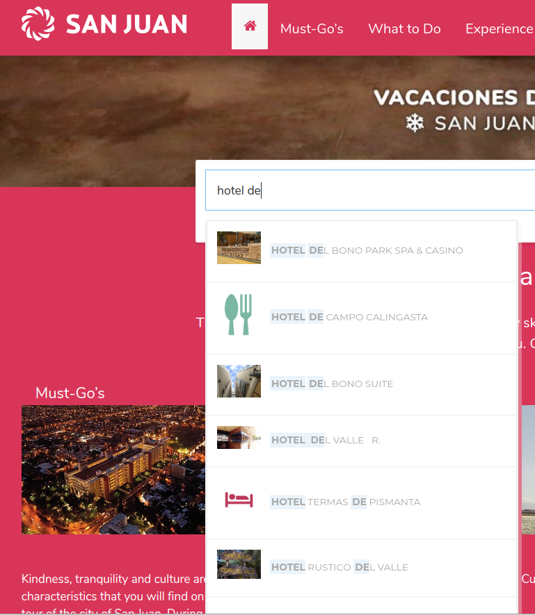
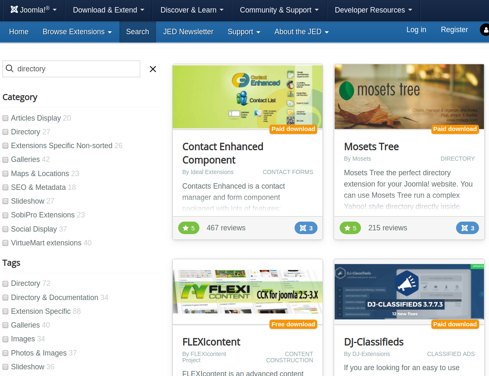
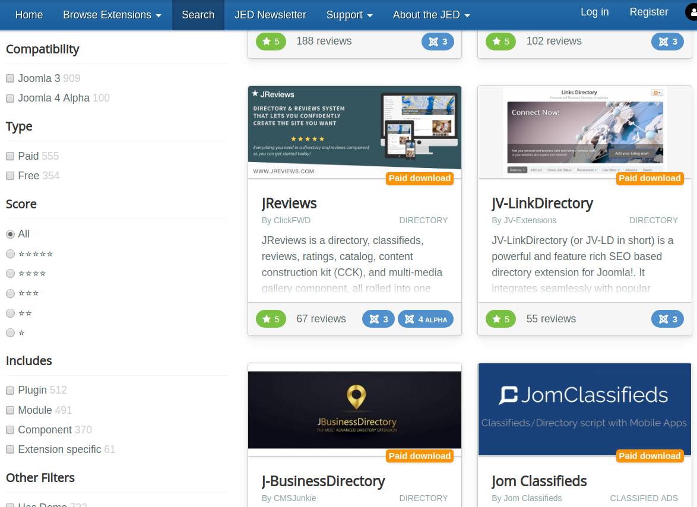
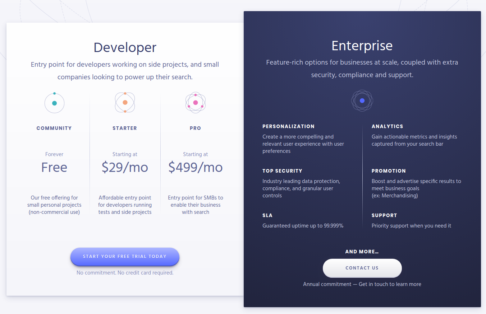
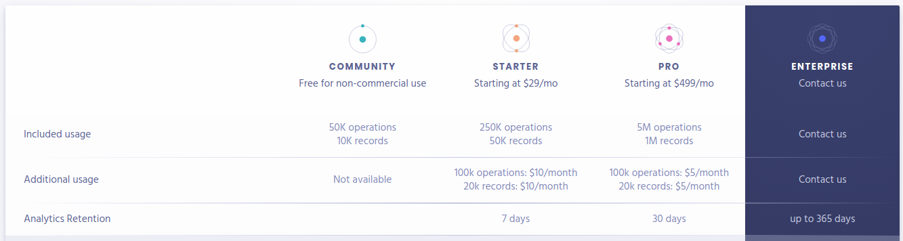

# What is Algolia?  <!-- .slide: class="extly-slide-style" data-background="#ffa619" -->

 <!-- .element: style="width: 10%" -->

- A hosted full-text, numerical, and faceted search engine<!-- .element: class="small" -->
- Capable of delivering real-time results from the first keystroke<!-- .element: class="small" -->
- Delivers products to accelerate search<!-- .element: class="small" -->
- Empower discovery experiences across any device and platform<!-- .element: class="small" -->
- Based on a Global Search Delivery Network<!-- .element: class="small" -->

## Search Beyond The Box  <!-- .slide: class="extly-slide-style plain" data-background-repeat="no-repeat" data-background-image="images/10-what/lando-seal.png" data-background-size="15%" data-background-position="95% 5%" -->

Innovative User Experiences

[eBook: Search Beyond the Box](https://go.algolia.com/search-beyond-the-box)<!-- .element: class="small" -->

## 1. Search matters (in numbers) <!-- .slide: class="extly-slide-style plain" data-background-repeat="no-repeat" data-background-image="images/10-what/lando-seal.png" data-background-size="15%" data-background-position="95% 5%" -->

- Bad search is expensive
- Users remember bad search experiences
- Great search produces business results

## 2. User intent: search beyond the box <!-- .slide: class="extly-slide-style plain" data-background-repeat="no-repeat" data-background-image="images/10-what/lando-seal.png" data-background-size="15%" data-background-position="95% 5%" -->

- Covering the basics
    - Textual relevance
    - Business relevance
    - Personalization
- User experience: advanced use cases

## Success Cases

### San Juan Turismo

[sanjuan.tur.ar](https://sanjuan.tur.ar/en/)

- Multilingual Search<!-- .element: class="small" -->
- Autocomplete Search Box<!-- .element: class="small" -->
- Advanced InstantSearch<!-- .element: class="small" -->
- Indexing K2 Articles and SobiPro<!-- .element: class="small" -->
- Support of search segmentation by scopes and languages<!-- .element: class="small" -->

Powered by [XT Search for Algolia](https://www.extly.com/xt-search-for-joomla.html)

## Autocomplete

## JED

 <!-- .element: style="width: 10%" -->

[extensions.joomla.org](https://extensions.joomla.org)

- Full-text Search for a Custom extension<!-- .element: class="small" -->
- Autocomplete Search Box<!-- .element: class="small" -->
- Advanced InstantSearch<!-- .element: class="small" -->
- Supported by Complex Ranking and Sorting System<!-- .element: class="small" -->

## InstantSearch

## InstantSearch - Fields & Facets

## Algolia Pricing

 <!-- .element: style="width: 90%" -->

## Algolia Pricing

 <!-- .element: style="width: 90%" -->
